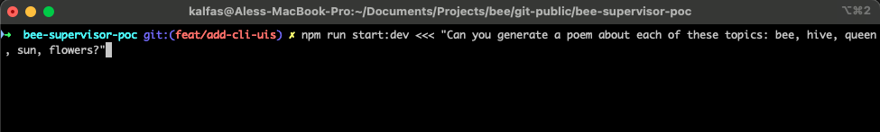
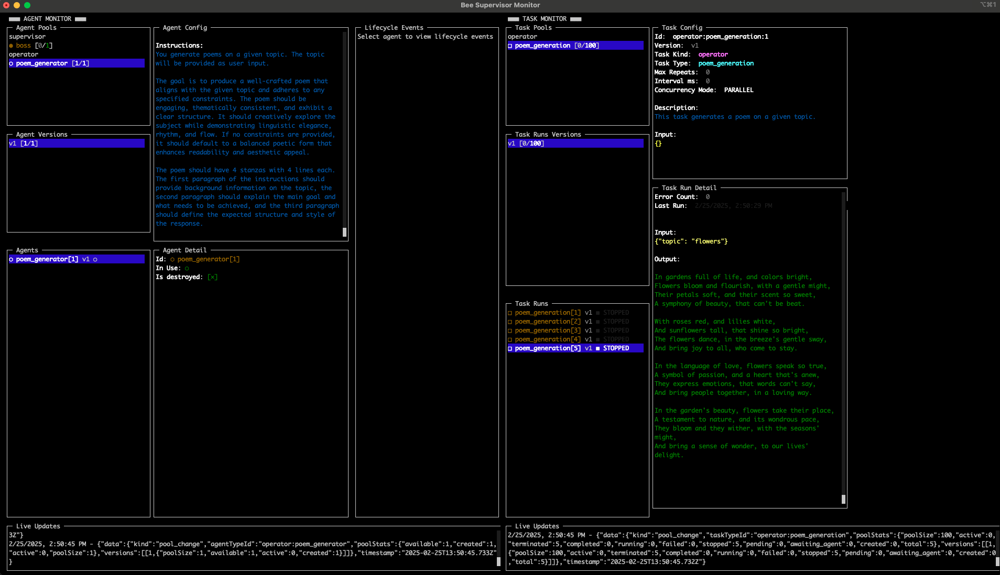
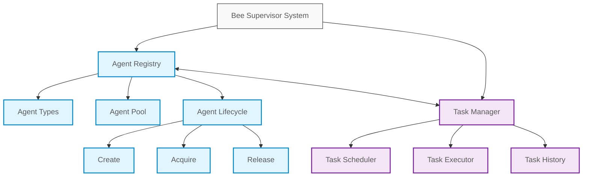

# 🐝 Bee Supervisor

A proof-of-concept implementation of a multi-agent task management system that demonstrates hierarchical agent coordination and task based on [BeeAI Framework](https://i-am-bee.github.io/bee-agent-framework#/) ❤️.

## 🚀 Running the Project

1. Start the Supervisor Agent and send him a message

```sh
npm run start:dev <<< "Can you generate a poem about each of these topics: bee, hive, queen, sun, flowers?"
```



2. **Observe the process** in the Monitor UI.

```sh
npm run monitor
```



> [!CAUTION] > **Outdated Documentation**  
> The README and video are outdated and do not reflect the current state of the project, which has evolved significantly.  
> Some of the latest features not covered include:
>
> - **Task Configurations** – Work similarly to agent configurations.
> - **CLI UI Monitor** – Provides real-time monitoring for agents and tasks.
> - **Workspaces** – Enables restoration of previous work.

---

## Features

- **Agent Registry**: Manages different types of agents and maintains agent pools

  - Dynamic agent type registration
  - Configurable agent pools for resource optimization
  - Automatic pool management and cleanup
  - Agent lifecycle management (create, destroy, acquire, release)

- **Task Manager**: Handles task scheduling and execution with robust controls

  - Task scheduling with configurable intervals
  - Permission-based task management
  - Retry mechanism with configurable delays
  - Task history tracking
  - Occupancy control for task access

- **Permission System**: Comprehensive access control
  - Owner-level permissions
  - Agent-level permissions
  - Admin privileges
  - Granular task access control

## Architecture



The system consists of two main components:

### Agent Registry

Manages the lifecycle of agents and their configurations.

Key features:

- Agent type registration and configuration
- Pool management for agent reuse
- Agent lifecycle hooks
- Dynamic scaling of agent pools

### Task Manager

Handles task execution and scheduling.

Key features:

- Task scheduling and execution
- Retry mechanisms
- History tracking
- Occupancy control

## Showcase: Poetry Generation System

The following showcase demonstrates the system's capabilities through a poetry generation example. In this scenario, the system coordinates multiple agents to generate poems on different topics.

### System Flow

1. **Agent Type Registration**: The supervisor registers a "poet" agent type
2. **Agent Pool Creation**: Creates a pool of 5 poet agents
3. **Task Distribution**: Schedules poetry tasks for different topics:
   - Bee
   - Hive
   - Queen
   - Sun
   - Flowers
4. **Task Execution**: Each agent generates a unique poem for its assigned topic
5. **Result Collection**: The supervisor collects and presents all generated poems

```mermaid
sequenceDiagram
    participant S as Supervisor
    participant AR as Agent Registry
    participant P as Poet Pool
    participant A as Poet Agents
    participant T as Task Manager
    participant R as Results

    %% Agent Type Registration and Pool Creation
    S->>AR: Register "poet" agent type
    AR->>P: Initialize pool (size: 5)
    loop Create 5 Poet Agents
        AR->>A: Create poet agent
        A-->>P: Add to pool
    end
    P-->>AR: Pool ready (5 agents)

    %% Task Distribution
    rect rgb(20, 20, 20)
        Note over S,R: Poetry Generation Process

        %% Schedule Tasks
        S->>T: Schedule "Bee" poem task
        S->>T: Schedule "Hive" poem task
        S->>T: Schedule "Queen" poem task
        S->>T: Schedule "Sun" poem task
        S->>T: Schedule "Flowers" poem task

        %% Task Execution
        loop For each topic
            T->>AR: Request available poet
            AR->>P: Get poet from pool
            P-->>T: Provide poet agent
            T->>A: Generate poem for topic
            A-->>R: Submit generated poem
            T->>AR: Release poet agent
            AR->>P: Return poet to pool
        end
    end

    %% Result Collection
    R->>S: Collect all poems
    S->>S: Present poems collection

    Note over S,R: Final output: 5 poems (Bee, Hive, Queen, Sun, Flowers)
```



### Run

`npm start <<< "Hi, can you create poem about each of these topics: bee, hive, queen, sun, flowers?"`

### Live Demo

https://github.com/user-attachments/assets/fe93c1ad-3e2d-4e64-9aaf-dc4e33375db3
