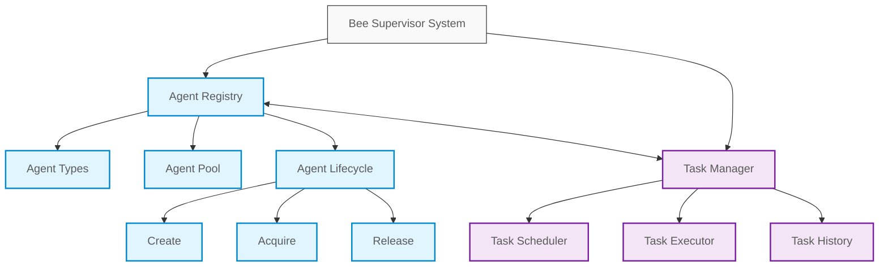

# 🐝 Bee Supervisor

A proof-of-concept implementation of a multi-agent task management system that demonstrates hierarchical agent coordination and task execution.

## Features

- **Agent Registry**: Manages different types of agents and maintains agent pools

  - Dynamic agent type registration
  - Configurable agent pools for resource optimization
  - Automatic pool management and cleanup
  - Agent lifecycle management (create, destroy, acquire, release)

- **Task Manager**: Handles task scheduling and execution with robust controls

  - Task scheduling with configurable intervals
  - Permission-based task management
  - Retry mechanism with configurable delays
  - Task history tracking
  - Occupancy control for task access

- **Permission System**: Comprehensive access control
  - Owner-level permissions
  - Agent-level permissions
  - Admin privileges
  - Granular task access control

## Architecture




The system consists of two main components:

### Agent Registry

Manages the lifecycle of agents and their configurations.

Key features:

- Agent type registration and configuration
- Pool management for agent reuse
- Agent lifecycle hooks
- Dynamic scaling of agent pools

### Task Manager

Handles task execution and scheduling.

Key features:

- Task scheduling and execution
- Retry mechanisms
- History tracking
- Occupancy control

## Showcase: Poetry Generation System

The following showcase demonstrates the system's capabilities through a poetry generation example. In this scenario, the system coordinates multiple agents to generate poems on different topics.

### System Flow

1. **Agent Type Registration**: The supervisor registers a "poet" agent type
2. **Agent Pool Creation**: Creates a pool of 5 poet agents
3. **Task Distribution**: Schedules poetry tasks for different topics:
   - Bee
   - Hive
   - Queen
   - Sun
   - Flowers
4. **Task Execution**: Each agent generates a unique poem for its assigned topic
5. **Result Collection**: The supervisor collects and presents all generated poems

```mermaid
sequenceDiagram
    participant S as Supervisor
    participant AR as Agent Registry
    participant P as Poet Pool
    participant A as Poet Agents
    participant T as Task Manager
    participant R as Results

    %% Agent Type Registration and Pool Creation
    S->>AR: Register "poet" agent type
    AR->>P: Initialize pool (size: 5)
    loop Create 5 Poet Agents
        AR->>A: Create poet agent
        A-->>P: Add to pool
    end
    P-->>AR: Pool ready (5 agents)

    %% Task Distribution
    rect rgb(20, 20, 20)
        Note over S,R: Poetry Generation Process

        %% Schedule Tasks
        S->>T: Schedule "Bee" poem task
        S->>T: Schedule "Hive" poem task
        S->>T: Schedule "Queen" poem task
        S->>T: Schedule "Sun" poem task
        S->>T: Schedule "Flowers" poem task

        %% Task Execution
        loop For each topic
            T->>AR: Request available poet
            AR->>P: Get poet from pool
            P-->>T: Provide poet agent
            T->>A: Generate poem for topic
            A-->>R: Submit generated poem
            T->>AR: Release poet agent
            AR->>P: Return poet to pool
        end
    end

    %% Result Collection
    R->>S: Collect all poems
    S->>S: Present poems collection

    Note over S,R: Final output: 5 poems (Bee, Hive, Queen, Sun, Flowers)
```



### Run

`npm start <<< "Hi, can you create poem about each of these topics: bee, hive, queen, sun, flowers?"`

### Live Demo

https://github.com/user-attachments/assets/fe93c1ad-3e2d-4e64-9aaf-dc4e33375db3

### Example Output

Here's a sample of the generated poems:

#### Bee Poem 📝

```
## Bee
1. In the garden, a buzzing sound
2. A tiny creature, flying round
3. With stripes of yellow, black as night
4. Collecting nectar, a busy delight
5. From flower to flower, it flits and plays
6. Gathering honey, in its busy ways
7. A symbol of industry, a wonder to see
8. The bee, a tiny marvel, wild and free

## Hive1. In the heart of summer, where sunflowers sway,
2. A hive stands bustling, in a busy day,
3. Bees flit and flutter, with purpose and might,
4. Collecting nectar, in the warm sunlight,
5. Their hive a marvel, of intricate design,
6. A testament to nature, in perfect align,
7. The queen bee reigns, with gentle grace,
8. Laying eggs and ensuring, the hive's warm space,
9. The workers labor, with diligent care,
10. Creating honey, beyond compare,
11. A sweet delight, that's savored with glee,
12. A taste of summer, for you and me.

## Queen
1. In grandeur, she sits upon her throne,
2. A queen of beauty, with a heart of stone,
3. Her majesty, a sight to behold,
4. With power and wisdom, her story's told,
5. Her kingdom flourishes, under her gentle hand,
6. With justice and kindness, she takes her stand,
7. A true leader, with a spirit so bright,
8. Guiding her people, through the dark of night,
9. Her legacy, a testament to her name,
10. A queen, forever remembered, in the annals of fame.

## Sun
1. Golden hues upon my face
2. Warming skin and filling space
3. Bright rays that shine so bold
4. Lighting up the world to behold
5. Sunrise in the morning sky
6. Painting clouds with colors high
7. The sun's sweet gentle touch
8. Bringing life to all that's clutch
9. Its beauty leaves me in awe and wonder
10. Filling my heart with joy and thunder

## Flowers
1. In the garden of life, they bloom and sway,
2. Petals of beauty, in every color of the day,
3. Their sweet fragrance fills the air,
4. As they dance in the breeze, without a care,
5. Roses, lilies, and sunflowers tall,
6. Each one unique, yet together they stand at all,
7. A symbol of love, of hope, of life and of might,
8. Flowers bring joy, to our world, and make it bright.
```
